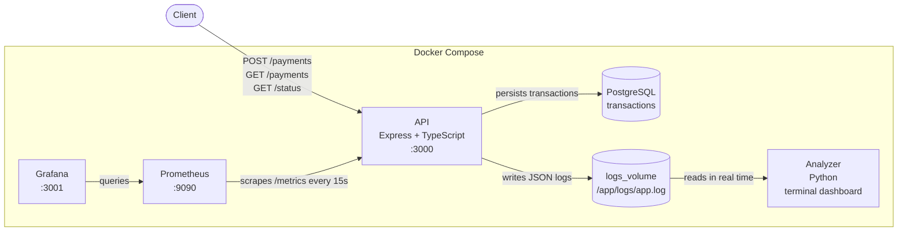

# NestPy-Observer

A **telemetry and observability** ecosystem simulating a real production environment. An API processes payments, persists transactions in PostgreSQL, and writes structured logs to a shared volume. A Python script consumes those logs in real time; Prometheus scrapes metrics from the API; Grafana visualizes them.

## Architecture



The API and Analyzer never communicate via HTTP — the only channel between them is a log file on disk, managed by Docker as a named volume.

## Tech Stack

| Layer | Technology |
|---|---|
| API | Express.js + TypeScript (ES Modules) |
| Database | PostgreSQL 17 |
| Analyzer | Python 3.13 |
| Metrics | Prometheus + prom-client |
| Dashboards | Grafana |
| Infrastructure | Docker + Docker Compose (multi-stage build) |

## Design Patterns

- **Strategy Pattern:** `PixPayment` and `CreditPayment` implement the same `PaymentStrategy` interface, allowing payment behavior to be swapped without changing the server code
- **Factory Pattern:** `PaymentsFactory` dynamically instantiates the correct strategy based on the request body
- **Data Structures:** the analyzer uses a `deque` (FIFO queue) to enqueue logs and a dictionary (hash table) to update counters in O(1)

## Getting Started

**Prerequisites:** Docker and Docker Compose installed. Copy `.env.example` to `.env` and fill in your credentials.

```bash
docker compose up --build
```

The API starts on port `3000`. The analyzer begins watching the log file automatically. Grafana starts pre-configured with the Prometheus datasource and the Payments Dashboard — no manual setup required.

| Service | URL |
|---|---|
| API | http://localhost:3000 |
| Prometheus | http://localhost:9090 |
| Grafana | http://localhost:3001 (admin / admin) |

## Endpoints

### `POST /payments`

```bash
curl -X POST http://localhost:3000/payments \
  -H "Content-Type: application/json" \
  -d '{"type": "pix", "amount": 500}'
```

Supported types: `pix` (limit R$1500) · `card` (limit R$5000)

### `GET /payments`

```bash
curl http://localhost:3000/payments
```

### `GET /payments/:id`

```bash
curl http://localhost:3000/payments/1
```

### `GET /status`

```bash
curl http://localhost:3000/status
```

### `GET /metrics`

Exposes metrics in Prometheus format for scraping.

```bash
curl http://localhost:3000/metrics
```

## Project Structure

```
NestPy-Observer/
├── api/
│   ├── payments/
│   │   ├── strategy.interface.ts # PaymentStrategy interface + Pix and Card implementations
│   │   └── payments.factory.ts # factory that instantiates the correct strategy
│   ├── server.ts # Express server + log system + routes
│   ├── db.ts # PostgreSQL connection pool + table initialization
│   ├── Dockerfile # multi-stage build (builder -> runner)
│   ├── .dockerignore
│   ├── package.json
│   └── tsconfig.json
├── analyzer/
│   ├── main.py # real-time log analyzer + terminal dashboard
│   └── Dockerfile
├── prometheus/
│   └── prometheus.yml # scrape config targeting api:3000
├── grafana/
│   └── provisioning/
│       ├── datasources/
│       │   └── datasource.yml # auto-provisions Prometheus datasource
│       └── dashboards/
│           ├── provider.yml # tells Grafana where to find dashboard JSONs
│           └── payments.json # Payments Dashboard definition
├── .env.example # environment variable template (no secrets)
└── docker-compose.yml # orchestration + shared volume + postgres + prometheus + grafana
```
