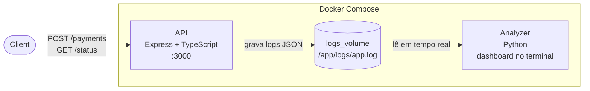

# NestPy-Observer

Ecossistema de **telemetria e observabilidade** simulando um ambiente real de produção. Uma API processa pagamentos e grava logs estruturados em um volume compartilhado; um script Python consome esses logs em tempo real e exibe um dashboard de métricas no terminal.

## Arquitetura



Os dois containers nunca se comunicam via HTTP — o único canal é o arquivo de log em disco, gerenciado pelo Docker como um volume nomeado.

## Tecnologias

| Camada | Tecnologia |
|---|---|
| API | Express.js + TypeScript (ES Modules) |
| Analisador | Python 3.13 |
| Infraestrutura | Docker + Docker Compose (multi-stage build) |

## Padrões de Projeto

- **Strategy Pattern:** `PixPayment` e `CreditPayment` implementam a mesma interface `PaymentStrategy`, permitindo trocar o comportamento do pagamento sem alterar o código do servidor
- **Factory Pattern:** `PaymentsFactory` instancia a estratégia correta dinamicamente com base no tipo recebido na requisição
- **Estruturas de Dados:** o analisador usa `deque` (fila FIFO) para enfileirar logs e dicionário (hash table) para atualizar contadores em O(1)

## Como Rodar

**Pré-requisito:** Docker e Docker Compose instalados.

```bash
docker compose up --build
```

A API sobe na porta `3000`. O analisador começa a monitorar os logs automaticamente.

## Endpoints

### `POST /payments`

```bash
curl -X POST http://localhost:3000/payments \
  -H "Content-Type: application/json" \
  -d '{"type": "pix", "amount": 500}'
```

Tipos suportados: `pix` (limite R$1500) · `card` (limite R$5000)

### `GET /status`

```bash
curl http://localhost:3000/status
```

## Estrutura do Projeto

```
NestPy-Observer/
├── api/
│   ├── payments/
│   │   ├── strategy.interface.ts # interface + estratégias Pix e Cartão
│   │   └── payments.factory.ts # factory que instancia a estratégia
│   ├── server.ts # servidor Express + sistema de logs
│   ├── Dockerfile # multi-stage build (builder/runner)
│   ├── .dockerignore
│   ├── package.json
│   └── tsconfig.json
├── analyzer/
│   ├── main.py # analisador em tempo real + dashboard
│   └── Dockerfile
└── docker-compose.yml # orquestração + volume compartilhado
```
